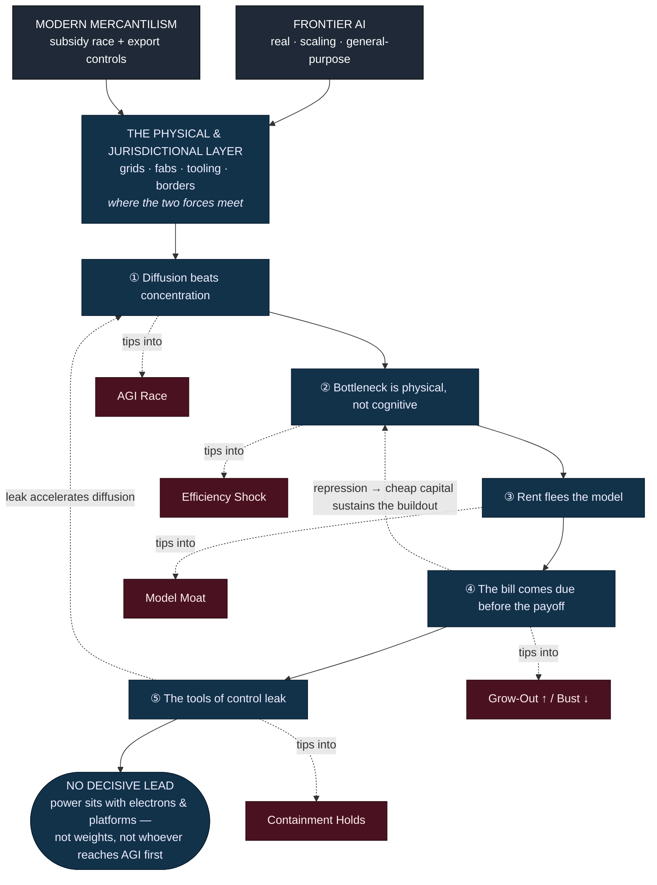

# Part 2 — Framework & Holistic Synthesis

*Dense master draft. This runs long by design so the argument is fully on the page; trim to ~3 pages for the Part 2 submission and harvest the detail into the ~5-page Analytical Appendix. Diagram is a Mermaid spec — redraw as a graphic for the final PDF.*

## In one paragraph

Two forces are reshaping the next decade: **frontier AI**, real and still scaling, and **modern mercantilism** — the subsidy-and-controls statecraft (CHIPS, IRA, the EU Green Deal, China's Big Fund, export licensing) that treats compute as a strategic good states pay to onshore and fight to deny. Our claim is that these two forces meet at the **physical and jurisdictional layer** — grids, fabs, chip-making tooling, borders — and that AI's power is gated *there*, not at the intelligence layer. The consequence is a world of pervasive impact without a decisive winner: capability diffuses rather than concentrates, the buildout is throttled by inputs no one can conjure on a software schedule, the debt raised to fund it forces the macro regime toward financial repression, and the West's containment tools leak. We hold this at roughly one-in-three odds and express it as a position on **five axes**, each with a tip-over threshold and the alternative world we would land in if it failed.

## How we arrived at these five axes

We did not start with five axes; we started with the full problem — the macro-financial loop, AI scaling and market structure, the physical buildout, labor, the trade order, bloc formation, and the tail risks — and asked of every sub-question *what does it actually turn on?* The sub-questions kept collapsing onto the same small set of underlying bets. "Who captures AI's economic surplus," "can export controls contain China," and "does anyone reach a decisive lead" all turned out to be downstream of two prior questions: **does capability concentrate or diffuse, and is the binding constraint physical or cognitive.** Those two are the independent *pivots*. The other three axes — where rent settles, whether the financing holds, whether the controls bind — largely *follow* from the pivots plus one background bet that institutions erode faster than they set. So the five are not a menu of themes; they are close to the minimal spanning set of independent bets the whole worldview rests on.

Two consequences of that derivation matter for how to read what follows. First, the axes are **not a linear causal chain**. The left-to-right order below (AI → who-profits → macro → geopolitics) is a *reading order*; the true wiring fans out from the two pivots, and two feedback loops make the base case circular (§6). Second, because the axes share a root — "capability diffuses" — the framework is both more coherent and more fragile than a diversified set of calls: knock out the root and several axes fail together (§6).

## The framework at a glance

| # | Axis | Our base case | If wrong → counter-world |
|---|---|---|---|
| 1 | **Diffusion beats concentration** | AI spreads as a general-purpose technology; no durable, decisive lead forms | **AGI Race** — a lead that doesn't diffuse (Western discontinuity *or* China's buildout) |
| 2 | **Physical, not cognitive** | The bottleneck is electrons/fabs/tooling on decade timelines; mercantilism builds and rations them | **Efficiency Shock** — algorithms leap, compute demand collapses, the grid stops binding |
| 3 | **Rent flees the model** | Weights commoditize; value migrates up-stack (distribution) and down (chip tooling) | **Model Moat** — the frontier ossifies; a lab/chip incumbent captures durable rent |
| 4 | **The bill before the payoff** | Debt matures faster than productivity diffuses → financial repression | **Grow-Out** (productivity in time) *or* **Bust** (capex bubble → debt-deflation) |
| 5 | **The tools of control leak** | Controls target the layer value left; order fragments into two stacks atop still-flowing trade | **Containment Holds / Hard Decoupling** — controls bite (esp. equipment); real bifurcation |

## The causal spine

The two forces converge on the physical layer and cascade down the five axes to one conclusion — *no decisive lead; power sits with electrons and platforms, not weights.* Solid arrows are the reading-order cascade from the two pivots (Axes 1–2); dotted arrows are the tip-overs into each counter-world; the two curved back-edges are the reinforcing loops that make the base case self-sustaining (§6).

## The five axes in depth

### ① Diffusion beats concentration

**The claim:** AI is genuinely powerful and still scaling — this is not a bubble on the fundamentals — but it spreads as a general-purpose technology; no actor holds a *durable, decisive* lead. Pervasive impact, no game-closing winner.

**Why we hold it.** The base rate for decisive technological leads is that they are transient. The United States held an atomic monopoly for exactly four years — 1945 to the first Soviet test in August 1949 — and that was under total secrecy, across a two-continent gap, with a physical-materials chokepoint (weapons-grade fissile material) far tighter than anything software affords; jet aircraft, radar, and ballistic missiles all diffused within five to ten years. The governing principle is that once a capability is shown to be *possible* and roughly how it was built, imitation beats invention. The current empirics already fit this pattern rather than the monopoly pattern: the price of a fixed capability has fallen roughly 100× in two years; open-weight models (Llama 405B, Qwen, DeepSeek) track the closed frontier within six to eighteen months; and DeepSeek's R1 reconstructed reasoning-model capability within months of it being demonstrated, for an estimated $5–6M. Two mechanisms make this structural rather than incidental. Distillation is a *one-way ratchet* — followers copy an expensive teacher at a lag and near-zero marginal cost, so capability propagates downward automatically — and algorithmic efficiency gains are *non-excludable*: each breakthrough a leader finds is captured by everyone. Even compute concentration, the single best argument *for* a durable lead, cuts the other way: massed frontier training is satellite-visible and power-hungry, which makes a lead *legible and targetable*, not safe. Finally, strategic forecasting has a documented bias toward over-predicting discontinuities — the 1957–61 "missile gap" was accepted wisdom, drove a generation of spending, and was simply false (the USSR fielded a handful of ICBMs; the US had hundreds). On the ground, pervasive labor displacement is not evidence *against* this axis but its signature: a technology good enough to substitute for tasks everywhere, captured decisively by no one — inference prices down ~99%, measurable junior-hiring compression, and task displacement running ahead of reinstatement.

**The best case against.** Some leads genuinely endure: nuclear-powered submarines and stealth aircraft held qualitative leads for 30–50 years, US carrier dominance for 70, TSMC's sub-5nm edge for 15. But every durable case rests on a *platform or physical-capital* moat — accumulated tacit manufacturing, ecosystem integration, materials science — not on software; the F-117 could not be open-sourced, and an AI architecture, once demonstrated, can be. The one break case we take seriously is **recursive self-improvement**: if autonomous R&D compounds capability faster than followers can copy *and* the compute gate holds, concentration becomes durable and this axis inverts. We weight it low because model gains remain gradual and efficiency cascades are empirically non-excludable — but it is precisely the scenario that would take down the whole framework, which is why it anchors the counter-world.

**Tip-over:** a capability discontinuity that visibly *fails* to diffuse within ~3 years, or demonstrated recursive self-improvement. The decisive lead need not be Western — it could be China's, via the buildout asymmetry in Axis 2. → **AGI Race.**
**Anchors:** no developer sustains a >12-month lead over the fifth-ranked frontier model; the ~90% collapse in the price of frontier-class capability.

### ② The bottleneck is physical, not cognitive

**The claim:** the binding constraint on frontier AI is electrons, fabs, chip-making tooling, and specialized labor that diffuse on decade timelines and resist capital — and modern mercantilism is what builds and rations them, turning a bottleneck into a prisoner's-dilemma trap.

**Why we hold it.** The true chokepoint is grid *interconnection*, not generation: the US queue exceeded ~2,700 GW of proposed projects in 2024 with median waits of five to seven years, and utilities in the densest corridors (Northern Virginia, Georgia, Ohio) are turning away or deferring 10–15+ GW of load they cannot serve. Around it sit constraints capital cannot compress: new transmission lines average ~10 years from proposal to energization; large transformers and gas turbines run multi-year lead times; the actual binding chip constraint has been *advanced packaging* (TSMC CoWoS) and high-bandwidth memory (SK Hynix ~50%+ share), not raw wafer starts; and the cleanroom and high-voltage-engineering labor pipeline takes three-to-five years to train — which is why TSMC's Arizona fab and Intel's Ohio fab both slipped on people, not money. Mercantilism supplies the demand side and converts the bottleneck into a trap: once every bloc subsidizes capacity (CHIPS ~$52B, EU Chips Act €43B, China's fund $150B+), standing down cedes the frontier, so all build at once — and they queue for the *same* fab slots, interconnection positions, and engineers. Industrial policy adds entrants to the queue; it does not expand throughput, and the simultaneous capex bids up the equilibrium real rate. History rhymes hard here: capital was never the binding input in the great build-outs. The Erie Canal took eight years (1817–25) with ample financing; US nuclear completed only a handful of large reactors after 1975 despite consensus and money, gated by 10+-year licensing and specialized construction; electrification ran 15–25 years, varying 3–5× by region on labor and coordination, not capital; and Apollo's critical path was aerospace engineers and novel manufacturing processes (the F-1 engine's brazing), not dollars. In every case subsidy accelerated the queue and left the physical constraint standing.

**The best case against.** Three counters are live and load-bearing. First, **algorithmic efficiency routes around the constraint**: DeepSeek trained an o1-class model for ~$5–6M on export-compliant chips, and if efficiency compresses required compute 10–100× on an 18–24-month clock, the multi-gigawatt buildout is over-provisioned before it completes. Second, **Jevons and inference-scaling** may make cheap capability *expand* total compute demand and shift it to distributed mature-node inference, so the constraint flips from capacity to utilization. Third — and most damaging — the constraint may be **jurisdiction-specific**: China adds ~150 GW of generation a year with ~27 reactors under construction and co-locates inland data centers with hydro and coal, against a decade-plus US licensing-and-permitting cycle. That makes the US bottleneck substantially *institutional* (FERC queues, PUC coordination) rather than physical — reformable by political will, and not binding on China at all.

**Tip-over:** efficiency collapses compute demand *and* interconnection queues start shortening → the grid stops binding (**Efficiency Shock**). The asymmetric variant — the constraint binds the US but not China — keeps this axis's base intact while flipping Axis 1 (a decisive lead exists, China's).
**Anchor:** at least one announced 1GW+ US data-center project slips publicly on power (~0.87) — our highest-conviction call.

### ③ Rent flees the model

**The claim:** weights commoditize (open-source and distillation close the gap fast; API prices collapse), so durable value migrates *up-stack* to distribution and proprietary deployment context and *down-stack* to a physical tooling chokepoint. The moat leaves the weights — but it does not vanish.

**Why we hold it.** The ~100× fall in inference price — GPT-3.5-class from ~$20 per million tokens in 2023 to under $0.10 by 2025 — is not evidence against moats; it is the *premise* of migration. The model layer is commoditizing while rent relocates. Up-stack, aggregation logic takes over: the commoditized layer is the one everyone can reach, so value accrues to whoever owns the user relationship and the deployment context — ChatGPT as a consumer default, Copilot in Office, Gemini in Workspace, with proprietary interaction-data flywheels that do not diffuse. The browser wars are the exact template: Netscape's technically superior browser was commoditized to zero (Microsoft bundled IE free to defend Windows; Google ran Chrome at $1B+/yr to protect search), and durable rent settled on the platforms above — nobody makes money on the browser. Down-stack, rent pools in physical chokepoints that genuinely do not diffuse: ASML holds ~100% of EUV lithography, NVIDIA's CUDA is a 10+-year developer-tooling lock-in, SK Hynix and two rivals own HBM, TSMC owns advanced packaging, and Cadence/Synopsys own ~80% of EDA. AWS is the proof that this is the normal shape, not the exception: it cut prices 67 times in a decade while holding 25–35% operating margins, because as raw compute commoditized it migrated value up to managed services with high switching costs. Electrification is the deeper rhyme — generation was regulated to thin margins, real electricity prices fell ~90% from 1900–1940, and essentially all the surplus migrated downstream to the appliances and to the firms that redesigned their processes around the electric motor.

**The best case against.** The strongest counter is that a *data* moat, not a weights moat, ossifies the frontier: Google Search survived on open protocols because its click-feedback index compounded non-replicably, and Bloomberg has held ~330,000 terminals at ~$24k/yr for 40 years on exclusive, compounding data. If proprietary RLHF and deployment-feedback data compound faster than distillation closes the gap, the frontier lab's advantage persists despite commoditized weights. Related: the frontier-to-open gap *stays large* precisely on the high-value agentic tasks (30–50-point leads on SWE-bench and GAIA) where enterprise willingness-to-pay is migrating — so there may be a durable premium tier. And if scaling returns simply do not flatten, whoever sustains the largest training run holds a definitional lead. We judge each below even odds — the gap is narrowing faster than the prior generation, reasoning traces distill (R1), and sovereign/non-ROI actors keep the field contested — but the data-flywheel case is the one to watch.

**Tip-over:** a frontier lab sustains an ~18-month lead that open weights and distillation cannot close, or a proprietary-data flywheel becomes non-replicable. → **Model Moat.** The tell: model prices *stop falling* while chip-maker margins *rise* — rent being captured, not commoditized.
**Anchors:** the ~90% API price collapse; at least one independent top-tier lab absorbed into a distribution incumbent (~0.50).

### ④ The bill comes due before the payoff

**The claim:** the debt raised to fund the capex race matures faster than AI's productivity gains diffuse into measured output, so states reach for financial repression — negative real rates as a debt-management tool. Two opposite failure modes bracket it: Grow-Out and Bust.

**Why we hold it.** The operative crux is *timing*, not magnitude. Prior general-purpose technologies took a decade-plus to show in measured productivity — electrification's TFP gains lagged the 1890s–1920s build-out by 10–15 years — while the financing clock now runs unusually fast: most G7 sovereigns issued heavily at near-zero rates in 2020–21 with 5–10-year maturities, and as that stock rolls into a higher-rate world interest costs jump *discontinuously*, already ~20% of US federal revenue and heading toward a quarter of it, atop ~120% debt/GDP and a 6–7% structural deficit before any capex. Markets need only *believe* fiscal dominance is the endgame for term premia to price it forward. Meanwhile AI's near-term macro signature is sector-specific bottleneck inflation — data-center power, suitable land, high-voltage-engineering wages, critical-mineral floors — which appears *before* any economy-wide TFP lift, handing central banks a demand-pull problem while they are assured the deflationary offset is coming; tighten and you abort the capex cycle, wait and expectations de-anchor. The resolution of that bind has a clean template: wartime yield-curve control (Fed, 1942–51) capped bills at 0.375% and long bonds at 2.5% while inflation ran 15–20% in 1946–47, silently eroding federal debt from ~120% to ~80% of GDP with no default, and the 1951 Accord restored independence *only after* the burden was manageable — repression first, escape second. Japan's more recent arc (debt ~100%→250%+, YCC to 2024) is structurally closer to a post-capex, high-debt, low-growth regime, and its disorderly August 2024 exit (yen −8% in days, a global carry unwind) is the reminder that the *exit* is more dangerous than the repression. The US has only norm- and appointment-based central-bank independence, not the statutory single-mandate armor the successful holdouts installed *before* the shock.

**The best case against.** Productivity has sometimes arrived fast enough to grow out of the debt. The 1995–2004 IT wave showed measurable TFP acceleration within 5–7 years, not the electrification 10–15 — and AI is information-led like IT, not physical like electrification. But that boom ran atop a *fiscal consolidation* (deficits to Clinton surpluses), a strong dollar, and low initial debt — conditions absent today; the offset would have to be both faster and land inside the 2027–30 cliff. The second counter is the **Bust inversion**: if the capex is a bubble (the telecom-fiber crash saw the Nasdaq fall 5,048→1,108 and 99% of fiber go dark, yet IT still added ~1.2pp of TFP and the banking system held), Fisher debt-deflation delivers the *same* negative-real-rate sign via *collapsing nominal rates*, not managed repression — the same headline metric, opposite regime, opposite trade. And some central banks *did* hold independence under stress (Bundesbank through the 1970s–80s, Volcker) — though each had statutory or credibility armor the US lacks.

**Tip-over:** two directions. **Grow-Out** if TFP accelerates >1pp above trend before the cliff bites. **Bust** if a financing shock triggers debt-deflation. Critically, repression and bust are *observationally confusable* on the headline metric (both print negative real rates) — distinguish by mechanism: repression shows *capped* nominal rates with anchored inflation; bust shows *collapsing* nominal rates with *widening* credit spreads.
**Anchor:** a sustained stretch of negative US real policy rates (~0.55) — deliberately not higher, because the number blends the repression and bust paths.

### ⑤ The tools of control leak

**The claim:** export controls are aimed at the layer value has already left; they leak structurally and buy years, not denial. The order does not cleanly decouple — it fragments into two loosely-coupled compute stacks atop physical trade that keeps flowing, with a live but low-probability Taiwan tail. The one durable Western lever is the equipment/tooling layer, not finished chips.

**Why we hold it.** The base rate for technology-denial regimes is unanimous: they slow diffusion, they do not stop it. COCOM coordinated 17 allies against the Soviet bloc for 45 years (1949–94) and worked in the 1950s–70s, but leaked through neutral transshipment and allied commercial pressure — the 1987 Toshiba-Kongsberg sale of submarine-propeller milling machines was the symbolic rot — and the Soviets stayed behind in computing while reaching parity in targeted military domains. US cryptography export controls collapsed in ~8 years once the knowledge was publishable (Zimmermann printed PGP's source as a First-Amendment-protected book; Washington capitulated in 1999–2000). The live leak vectors for chips are the same species: an estimated 100k+ restricted accelerators reaching China via third-country transshipment and shell entities; controls *incentivizing* the very efficiency research that routes around them; and open weights that cannot be un-published. The order is *rerouting, not decoupling* — post-2018 tariffs pushed US imports from Vietnam from $49B (2017) to $114B (2022) and made Mexico the top US goods partner by 2023 (with high Chinese input content), yet the US goods deficit hit a record $1.06T in 2022: flows redirect, they do not fall. And the state-catch-up template is well-established — Japan's MITI VLSI program (¥72B) took Japanese firms to ~80% of global DRAM by 1988 before the 1986 managed-trade agreement, which is exactly the play China's Big Fund is running. So the container is two loosely-coupled stacks over trade that keeps flowing, swing states unable to hold a durable middle, and a Taiwan tail that stays live because Beijing's calculus there is not governed by economic interdependence.

**The best case against — and it is strong.** Some chokepoints *do* durably bind, and they cluster at the *equipment* layer. ASML's EUV monopoly is ~100% with no second source, the product of 25+ years of R&D and irreproducible tacit knowledge, remotely disable-able by software, and China's indigenous efforts (SMEE) lag 10+ years on physics, not policy. The Japan–Netherlands–US trilateral (January 2023) has *held* through aggressive ratcheting despite China representing ~30% of ASML's historical revenue — allied defection into commercial suicide was prevented, which COCOM eventually could not sustain. Nuclear non-proliferation broadly held for decades because the inputs are scarce, trackable, and state-limited (though India, Pakistan, Israel, and North Korea show the "hold" is relative). And the "slow is enough" argument bites: if controls buy a 6–8-year retardation and the strategically decisive window falls inside it, a transient lead is sufficient regardless of eventual leakage.

**Tip-over:** equipment-layer controls durably prevent indigenous leading-edge production, or real economic decoupling collapses goods trade. → **Containment Holds / Hard Decoupling.** The honest split we adopt: *chip-flow controls leak; EUV-tooling controls may not* — which narrows the headline "containment expires" to "containment at the output layer expires; containment at the means-of-production layer may hold."
**Anchors:** 100k+ restricted chips reach China in a year (~0.65); US–China goods trade holds ≥80% of prior (~0.62).

## Internal tensions & reinforcement — the framework as a system

The five axes are one bet — that AI is real but diffuses, and is therefore gated by physics and jurisdiction — expressed five ways. That has three integrated consequences: two that make the base case cohere, and one that concentrates its risk.

**Two feedback loops make the base case self-reinforcing.** The first binds Axes 2 and 4 — a **capex–repression loop**: mercantilist subsidy drives everyone to build at once → physical scarcity plus debt → financial repression → cheap, available capital → which *sustains* the very build-out that created the scarcity. Repression is not just a consequence of the buildout; it feeds back to prolong the physical constraint rather than clear it. The second runs Axes 1 → 3 → 5 — a **commoditization–leak loop**: diffusing capability means rent leaves the weights, which means export controls are aimed at an emptying layer, which means they leak, which accelerates diffusion further. Labor sits at the confluence of Axes 1 and 2 — real-but-diffusing capability substitutes for tasks broadly while the political brake forms only reactively, and the likeliest *early* trigger is not a jobs backlash but a single high-salience AI failure routed through a safety-and-liability frame. These couplings are why our forecasts move together rather than as a scatter: they are reading the same underlying regime.

**The shared root is also the concentrated risk.** Every axis hangs off "capability diffuses." So the counter-worlds are *correlated, not independent*: if capability turns out to be decisive, the model re-moats (Axis 3 flips), controls become a decisive strategic lever (Axis 5 flips), and no-decisive-lead inverts into winner-take-all (Axis 1 flips) — all at once, and in the same efficiency regime that would make the lead durable. The elegance of a one-root framework is that everything follows from a single premise; the fragility is identical — one premise failing takes down four axes together. This is the honest answer to "aren't these just five separate guesses?": no, they are one premise stress-tested five ways, which makes the view both more coherent than a list and more brittle than it looks. The single most important thing to monitor is therefore the root itself — the diffusion-vs-concentration signal — because it is upstream of almost everything else.

**Two genuine cracks — and only one lives inside an axis.** The first is *intra-axis*: on Axis 4, the base case (repression) and its own downside counter-world (Bust) both deliver negative real rates, so the anchor forecast cannot distinguish them and the trade inverts — own duration under repression, own cash under a bust. We resolve it by splitting the signal (capped nominal rates + anchored inflation = repression; collapsing nominal rates + widening spreads = bust). The second crack does *not* belong to any single axis: the framework's *title* ("electrons") rests on Axis 2 while its *conclusion* ("no decisive lead") rests on Axis 1, and these can fail independently. The Efficiency Shock kills Axis 2 while leaving Axis 1 standing — cheaper compute diffuses faster, so "no decisive lead" is if anything *strengthened*; the China-asymmetry case keeps Axis 2 while flipping Axis 1 — the constraint is real but binds only the US, so a decisive lead exists after all. This cross-axis separability is invisible in a per-axis table, which is exactly why the system view is not optional. Put plainly: the per-axis analysis tells you how each bet fails alone; this section tells you the bets are wired together — reinforcing on the way up, and, through their shared root, failing as a bundle on the way down.

## Bottom line

The race everyone is watching — who reaches AGI first — is not the race that matters. Because AI is real but diffuses, its power is gated at the physical and jurisdictional layer that modern mercantilism is busy building and fighting over, and the decisive variable is who controls power and platforms, not weights. We hold that view at roughly one-in-three odds, we can name the five thresholds that would move us off it, and — because the axes share a root — we know they are most likely to be wrong all at once, in the world where capability stops diffusing and starts to concentrate.
